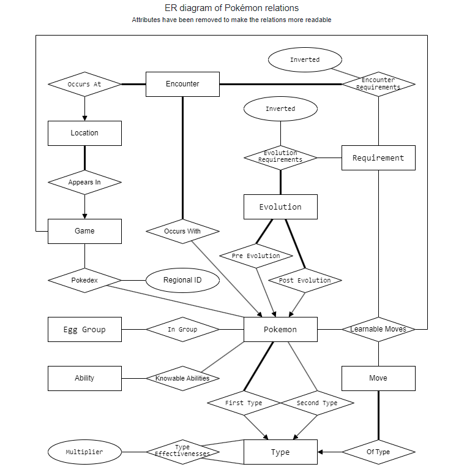
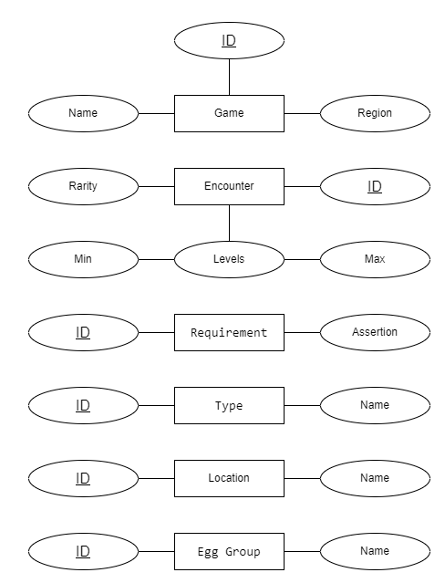
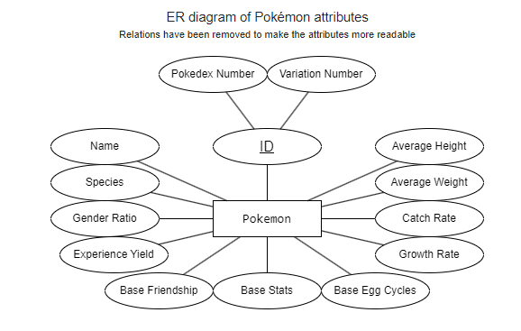
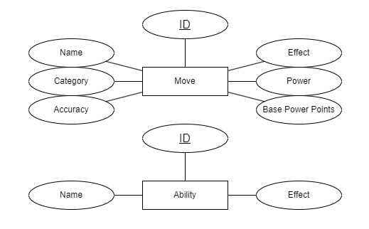

# pokemon_database
## 概述
该项目使用了一个包含大量神奇宝贝属性信息的数据库。这些数据从Pokemon官方网站抓取，包含1008个神奇宝贝的能力，属性，地点等多个信息。
该数据库共有17个表，总共有超过100万行的数据。在这个项目中，我们基于python中的psycopg2库，通过sql语句，python函数，PLpgSQL函数与数据库交互，实现了多个复杂的功能。 
dump.sql文件中储存了本项目中使用的所有数据

## 数据库ER图

## 核心功能
1. 自定义pokemon的属性：用户首先选择pokemon来自哪个游戏，接着选择自定义的Pokemon，接着选择Pokemon的能力，接着选择Pokemon的技能，可以选择四个技能。
在自定义的过程中，每个选择都是基于之前的选择变化的。比如说我们只会提供选择的游戏中存在的Pokemon给玩家选择。在玩家选择完成后，我们会打印出自定义Pokemon的信息
2. 进化Pokemon： 可以输出给定Pokemon是由什么进化来的，和可以进化为什么，还有进化的要求是什么。这里会有多种进化要求，可能是OR关系，也可能是AND关系。
3. 计算Pokemon的密度：输出给定区域中每个地点的名字以及该地点Pokemon的平均密度
4. 遭遇Pokemon：输出给定地点可能遇到的每个Pokemon的基本信息，如名字，类型，稀有度，技能等
5. Pokemon之间战斗：给定两个Pokemon的名字和对应的游戏，输出他们每回合相互攻击造成的伤害和血量变化

以上这些核心功能的实现非常高效，最坏情况下都在0.1秒内完成

## 我的收获
1. 熟练使用sql语句，掌握了sql中聚合，排序，分组，条件查询，使用Join进行多表查询，子查询等技能
2. 学会优化sql语句从而提高查询性能，该项目的数据库有超过100万条数据，要实现在0.1秒完成查询并输出对于sql语句的优化有较大的挑战。
3. 学会使用python语句与sql数据库进行交互。