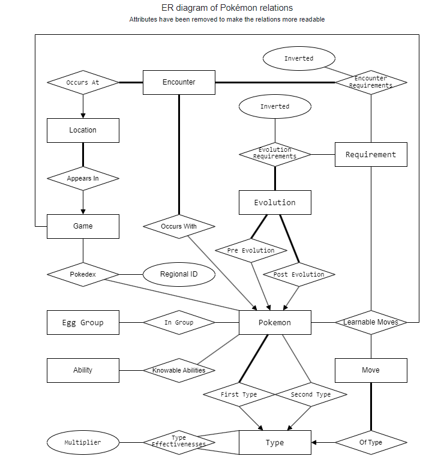
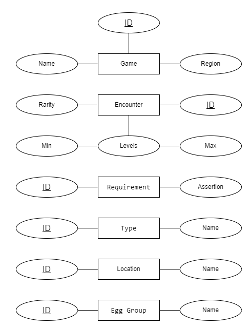
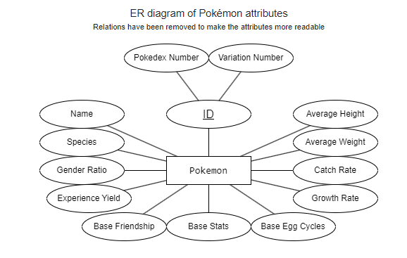
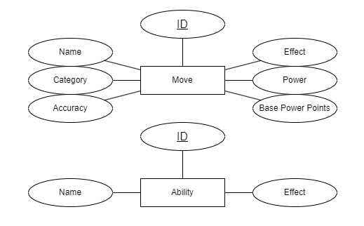

# pokemon_database
## 概述
该项目使用了一个包含大量神奇宝贝属性信息的数据库。这些数据从Pokemon官方网站抓取，包含1008个神奇宝贝的能力，属性，地点等多个信息。
该数据库共有17个表，总共有超过100万行的数据。在这个项目中，我们基于python中的psycopg2库，通过sql语句，python函数，PLpgSQL函数与数据库交互，实现了多个复杂的功能。

## 数据库ER图

